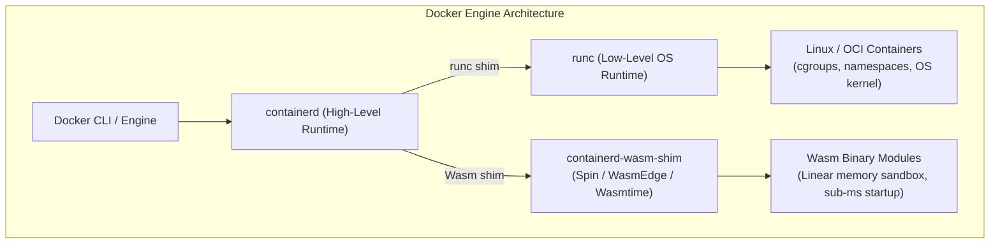
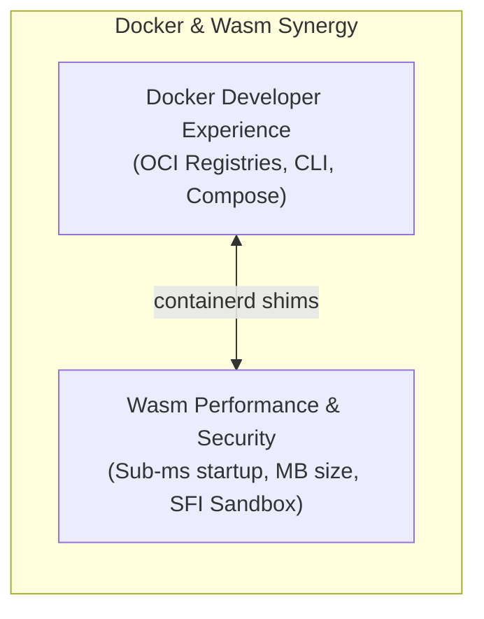

## Why I'm reading this
To examine the technical relationship, architectural trade-offs, and integration mechanics between WebAssembly (Wasm) bytecode runtimes and Docker containerization technology across serverless, cloud, and edge infrastructure.

## Key findings / notes

WebAssembly (Wasm) and Docker represent complementary technologies that address application portability and isolation at different levels of the execution stack. While Wasm operates as a portable instruction set format running inside lightweight stack-based virtual machine runtimes (e.g., Wasmtime, WasmEdge, Spin), Docker provides an enterprise developer experience and orchestration suite for building, packaging, and distributing container images. Rather than competing, Docker and Wasm work synergistically: Docker uses custom `containerd` shims to manage Wasm workloads side-by-side with traditional Linux containers.

---

### 1. Bytecode VM vs. Operating System Virtualization

The fundamental distinction between Wasm and Docker lies in their isolation boundaries and targets:

- **WebAssembly:** A W3C standard binary instruction format compiled from 40+ source languages (Rust, C/C++, Go, C#). It runs on a stack-based virtual machine, achieving near-native performance through JIT/AoT compilation. Isolation is enforced at the process memory level via linear memory bounds checking and WASI capability delegation.
- **Docker Containers:** Leverages Linux kernel primitives (`namespaces`, `cgroups`, `chroot`) to isolate processes at the operating system level. Containers package the entire root filesystem, dependencies, and OS binaries necessary to run an application.

---

### 2. Integration Architecture: containerd Shims

Docker Engine manages application lifecycles through `containerd`, a high-level container runtime. Standard container execution delegates low-level kernel interaction to `runc`. 

To support WebAssembly, the container ecosystem developed custom **`containerd` shims** (such as `containerd-wasm-shim` created by Fermyon, Deislabs, and the Bytecode Alliance). These shims plug directly into `containerd`, bypassing `runc` to launch Wasm runtimes (WasmEdge, Spin, Wasmtime) directly:

1. **Image Packaging:** Wasm binaries are packaged as valid OCI (Open Container Initiative) artifacts.
2. **Execution Dispatch:** When `docker run` or Kubernetes schedules a Wasm OCI image, `containerd` detects the runtime handler target and routes execution to the corresponding Wasm shim instead of `runc`.
3. **Unified Developer Experience:** Developers build, push, pull, and orchestrate Wasm modules using familiar Docker tools (`docker build`, `docker desktop`, `docker compose`).

---

### 3. Synergies and Layered Benefits

Combining Docker and WebAssembly yields significant operational benefits:

- **Sub-Millisecond Cold Starts:** Wasm runtimes instantiate in microseconds to milliseconds (compared to hundreds of milliseconds or seconds for Linux containers), enabling true on-demand serverless scaling.
- **Extreme Footprint Reduction:** Wasm OCI images are often under 5–10 MB (versus hundreds of megabytes for Linux container images), dramatically reducing bandwidth and storage overhead.
- **Multi-Architecture Portability:** A single compiled `.wasm` binary executes identically across x86_64, ARM64, and RISC-V hardware without needing architecture-specific container builds.
- **Layered Security Model:** Combines Wasm memory sandboxing (zero ambient authority, linear memory bounds) with Docker container namespace isolation, establishing multi-layered defense-in-depth.

---

### 4. Modern Ecosystem Innovations

- **WASI Preview 2 & Component Model:** Rebases WASI on a composable type system, allowing Wasm components written in different programming languages to interoperate seamlessly without custom glue code.
- **SpinKube:** An open-source project (collaboratively developed by Fermyon, Microsoft, SUSE, and LiquidReply) that integrates Spin Wasm workloads directly into Kubernetes clusters, achieving higher workload density per node compared to traditional pod deployments.

---

### 5. Architectural Comparison Matrix

| Feature / Dimension | Linux Containers (Docker) | WebAssembly Runtimes (Wasm) | Combined Docker + Wasm |
| :--- | :--- | :--- | :--- |
| **Isolation Boundary** | OS kernel (`cgroups`, `namespaces`) | In-process Software Fault Isolation (SFI) | Layered OS + Memory Sandbox |
| **Image Size** | 50 MB – 1 GB+ | 1 MB – 25 MB | 1 MB – 25 MB (OCI packaged) |
| **Startup Overhead** | 100 ms – 5 s | < 1 ms – 5 ms | < 5 ms |
| **Cross-Platform** | Requires multi-arch builds (`buildx`) | Truly portable bytecode across CPU architectures | Truly portable via unified OCI image |
| **OS Access** | Full Linux syscall interface | Restricted to WASI capability declarations | Managed via containerd shims & WASI |

---

## Quotes / snippets worth keeping

> "In a famous 2019 tweet, Docker co-founder Solomon Hykes noted: 'If WASM+WASI existed in 2008, we wouldn't have needed to create Docker. That's how important it is. Webassembly on the server is the future of computing.'" — Docker Blog

> "By marrying these two tools, developers can easily reap the performance benefits of WebAssembly with containerized software development." — Sohan Maheshwar

## Concepts to extract
- [x] [[WebAssembly_vs_Docker]]
