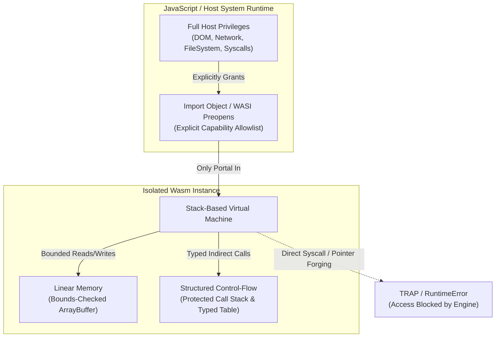
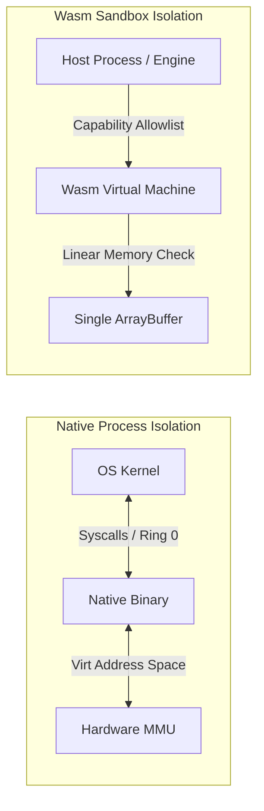

## Why I'm reading this
To synthesize the foundational security invariants, threat models, and architectural boundaries of WebAssembly (Wasm) sandboxing across both client-side browser runtimes and server-side multi-tenant WASI execution environments.

## Key findings / notes

WebAssembly (Wasm) and the WebAssembly System Interface (WASI) establish a lightweight, memory-safe, capability-driven sandboxing substrate that operates with zero ambient authority across browser engines, cloud microservices, edge nodes, and trusted execution environments (TEEs). Unlike traditional OS native processes that inherit all privileges of the executing user account, a Wasm module is instantiated inside a strict software-fault isolation (SFI) boundary where memory access is constrained to a single bounds-checked buffer and interaction with external resources occurs strictly via explicitly granted host capabilities.



---

### 1. Fundamental Sandbox Invariants and Isolation Mechanics

The WebAssembly sandbox is enforced by four core structural invariants verified by the engine prior to and during code execution:

1. **Capability-Based Authority Model:**
   A Wasm module possesses zero ambient authority upon instantiation. It cannot dereference host pointers, execute native syscalls, or access host APIs (such as `fetch`, `document`, or filesystem handles). All host interactions must be routed through functions explicitly provided in the `import object` (or WASI preopened capabilities). If a capability is omitted from the import object, the module physically lacks the mechanism to perform that operation.

2. **Bounds-Checked Linear Memory:**
   Module memory consists of a single, contiguous array of raw bytes known as `linear memory` (in JS, a `WebAssembly.Memory` backed by an `ArrayBuffer`). Every load ($\mathrm{load}_\nu \, m(addr)$) and store ($\mathrm{store}_\nu \, m(addr, v)$) operation is subjected to dynamic or hardware-assisted bounds checking:
   $$\text{Access Valid} \iff addr + |\nu| \le \text{MemSize}(m)$$
   Any attempt to read or write beyond `memory.byteLength` triggers a deterministic `trap` (`WebAssembly.RuntimeError`). Buffer overflows occurring inside the module remain strictly trapped inside its linear memory and cannot access host memory or adjacent instances.

3. **Structured Control-Flow Integrity (CFI):**
   Classical native attack vectors like return-oriented programming (ROP) or jump-oriented programming (JOP) are rendered impossible by design:
   - The execution stack and return addresses are maintained in separate, host-protected engine memory unreachable by Wasm instructions.
   - Direct branches target only statically validated label hierarchies.
   - Indirect calls (`call_indirect`) operate via an indexed table of typed function references. The runtime verifies that the signature at the call site matches the target function type; any mismatch results in an immediate trap.

4. **Module Validation Gate:**
   Before bytecode execution begins, the engine runs static verification (`wasm-validate`) to guarantee control-flow graph consistency, type safety, and stack balance, rejecting malformed or tampered modules upfront.

```wat
;; WebAssembly Text (WAT) snippet showing bounds-checked memory access
(module
  (memory (export "memory") 1)            ;; 1 page = 64 KiB
  (func (export "readOffset") (param $ptr i32) (result i32)
    (i32.load (local.get $ptr)))          ;; Traps if $ptr >= 65536
)
```

---

### 2. Threat Surface: Browser vs. WASI Multi-Tenant Server Runtimes

While Wasm eliminates arbitrary code execution outside its boundary, security risks vary significantly between client and server deployments:

| Threat Class | Browser Sandbox Context | WASI / Multi-Tenant Cloud Context | Mitigation Strategy |
| :--- | :--- | :--- | :--- |
| **Spatial Memory Corruption** | Contained inside `ArrayBuffer`; cannot corrupt browser process memory. | Contained within module heap; prevents process memory corruption. | Engine bounds checking & explicit `maximum` memory caps. |
| **Confused Deputy Bugs** | JS glue code passes unvalidated `(ptr, len)` tuples to Wasm. | Host stubs accept malformed inputs from untrusted tenant WASI modules. | Strict validation & bounds clamping of all host-guest buffer parameters. |
| **Spectre / Timer Channels** | High-resolution timers (`performance.now()`) enable cache-timing leaks across threads. | Cross-tenant CPU cache side channels in shared hardware environments. | COOP/COEP isolation, timer jitter, Swivel compiler transformations, MPK/CET. |
| **Resource Starvation** | Unbounded compute loops block main thread; high memory allocation OOMs tab. | WASI/WASIX syscall floods (fsync, net send) exhaust host CPU, I/O, or entropy. | cgroups, eBPF resource monitoring, WASI capability rate-limiting, engine fuel meters. |

---

### 3. Advanced Hardening: Hardware and Compiler Innovations

To defend against microarchitectural vulnerabilities (such as Spectre) and enforce granular isolation in high-throughput multi-tenant environments, advanced sandboxing frameworks integrate secondary defenses:

- **Swivel (Spectre Hardening):** Recompiles Wasm modules to enforce linear block partitioning, shadow stacks, and heap masking. In deterministic mode, conditional branches are converted into safe indirect jumps, eliminating branch predictor poisoning.
- **Cage (ARM64 MTE & PAC):** Integrates Memory Tagging Extensions (MTE) and Pointer Authentication Codes (PAC) via LLVM passes to detect out-of-bounds or use-after-free conditions with sub-5% overhead.
- **Trusted Execution Environments (Twine / SGX):** Encloses Wasm runtimes inside Intel SGX enclaves, combining hardware confidentiality and integrity with software WASI sandboxing for secure confidential computing.

---

### 4. Browser Isolation Policies: COOP, COEP, and CSP

In browser environments, multithreaded Wasm requires `SharedArrayBuffer` for shared memory across Web Workers. Because shared memory enables precise custom timers needed for side-channel attacks, browsers enforce **Cross-Origin Isolation**:

```http
Cross-Origin-Opener-Policy: same-origin
Cross-Origin-Embedder-Policy: require-corp
```

Under Content Security Policy (CSP), compiling Wasm requires explicit authorization. The modern standard introduces `'wasm-unsafe-eval'`, which permits WebAssembly instantiation without enabling dangerous JavaScript `eval()`:

```http
Content-Security-Policy: default-src 'self'; script-src 'self' 'wasm-unsafe-eval'; object-src 'none';
```

#### Secure Least-Privilege JS Loader Pattern
```javascript
async function loadSandboxedModule(url, expectedHashB64) {
  const res = await fetch(url, { credentials: "same-origin" });
  if (!res.ok || res.headers.get("content-type") !== "application/wasm") {
    throw new Error("Invalid response or MIME type");
  }
  const bytes = await res.arrayBuffer();

  // 1. Verify Subresource Integrity (SRI)
  const digest = await crypto.subtle.digest("SHA-256", bytes);
  const gotHash = btoa(String.fromCharCode(...new Uint8Array(digest)));
  if (gotHash !== expectedHashB64) throw new Error("Integrity mismatch");

  // 2. Define restrictive, capability-scoped import object
  const importObject = {
    env: {
      logMessage(ptr, len) {
        // Clamp length to prevent reading beyond intended log buffer
        const clampedLen = Math.min(len, 2048);
        const mem = new Uint8Array(instance.exports.memory.buffer, ptr, clampedLen);
        console.log("[Wasm Log]", new TextDecoder().decode(mem));
      }
    }
  };

  const { instance } = await WebAssembly.instantiate(bytes, importObject);
  return instance;
}
```

---

### 5. Architectural Comparison: Wasm Sandbox vs. Native OS Process



| Dimension | Native OS Process | WebAssembly Sandbox |
| :--- | :--- | :--- |
| **Isolation Boundary** | Hardware MMU & OS Kernel Ring 0/3 | Software Fault Isolation (SFI) & Runtime Engine |
| **Default Privilege** | Ambient authority (inherits user permissions) | Zero ambient authority (capability opt-in) |
| **Address Space** | Sparse Virtual Memory Space | Single contiguous `ArrayBuffer` |
| **Syscall Surface** | Hundreds of OS syscalls (open, socket, exec) | 0 syscalls (only imported host functions) |
| **Startup Latency** | Tens to hundreds of milliseconds | Sub-millisecond to <5 ms (AoT compiled) |

---

## Quotes / snippets worth keeping

> "The single idea that makes WebAssembly safe is capability-based execution. A compiled module cannot name a syscall, dereference a host pointer, or reach document directly. It can only call functions that JavaScript explicitly placed in the import object... Auditing the import object is auditing the capability set." — WebAssembly Wasm Guide

> "WebAssembly and WASI together form a portable, memory-safe, capability-driven sandboxing substrate used for in-process isolation of untrusted code... bounds checking protects the host, not your application logic. Wasm contains memory-safety bugs, it does not eliminate them." — Emergent Mind Paper Survey

## Concepts to extract
- [x] [[WebAssembly_Sandboxing]]
