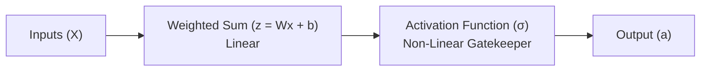

## The reading

In artificial neural networks, an **activation function** is a mathematical formula applied to the output of a neuron. It determines whether a neuron should "fire" (be activated) and how strong its signal should be, based on the input it receives.

Without activation functions, neural networks would be limited to solving simple linear problems (like drawing straight lines). Activation functions introduce **non-linearity**, enabling networks to learn complex patterns in images, audio, and text.

---

### 1. The Core Mechanism: From Linear to Non-Linear
A neural network neuron performs two steps:
1.  **Linear Summation:** Combines input values ($X$) with weights ($W$) and adds a bias ($b$):
    $$z = \sum (w_i \cdot x_i) + b$$
2.  **Activation:** Passes $z$ through an activation function ($\sigma$) to produce the final output ($a$):
    $$a = \sigma(z)$$

#### Why Non-Linearity is Essential
If we do not use an activation function, the neuron output is purely linear ($a = z$). If we stack multiple layers of linear neurons, the overall model remains completely linear. For example, a two-layer linear network computes:
$$a_2 = W_2(W_1 X + b_1) + b_2 = (W_2 W_1) X + (W_2 b_1 + b_2) = W_{\text{combined}} X + b_{\text{combined}}$$

Mathematically, this means a 100-layer neural network without activation functions has the exact same learning capacity as a single-layer model. Non-linear activation functions allow the network to warp, bend, and shape the data space to draw complex decision boundaries.

---

### 2. Common Activation Functions

#### 1. Sigmoid Function
The Sigmoid function maps any real-valued number into a value between $0$ and $1$.
*   **Formula:** 
    $$\sigma(z) = \frac{1}{1 + e^{-z}}$$
*   **Range:** $(0, 1)$
*   **Primary Use Case:** Output layer of binary classification models (where output represents a probability).
*   **Drawback:** *Vanishing Gradient Problem.* When inputs are very large or very small, the curve becomes flat (gradient approaches zero), making it difficult for the network to update its weights during training.

#### 2. Tanh (Hyperbolic Tangent) Function
The Tanh function is similar to Sigmoid but maps values between $-1$ and $1$.
*   **Formula:** 
    $$\tanh(z) = \frac{e^z - e^{-z}}{e^z + e^{-z}}$$
*   **Range:** $(-1, 1)$
*   **Primary Use Case:** Hidden layers of neural networks. Because it is zero-centered, it helps speed up convergence during optimization.
*   **Drawback:** Also suffers from the vanishing gradient problem at extreme inputs.

#### 3. ReLU (Rectified Linear Unit)
ReLU is the default activation function for hidden layers in modern deep learning models.
*   **Formula:** 
    $$f(z) = \max(0, z)$$
*   **Range:** $[0, \infty)$
*   **Primary Use Case:** Hidden layers in deep neural networks and convolutional neural networks (CNNs).
*   **Advantages:** Extremely fast to compute (only requires a threshold comparison) and does not saturate for positive inputs, mitigating vanishing gradients.
*   **Drawback:** *Dying ReLU.* If a neuron's weights are updated such that it always outputs negative values, it will output zero forever. That neuron becomes "dead" and ceases to learn.

#### 4. Leaky ReLU
Leaky ReLU addresses the "Dying ReLU" problem by allowing a small, non-zero gradient when the input is negative.
*   **Formula:** 
    $$f(z) = \max(\alpha z, z) \quad (\text{where } \alpha \approx 0.01)$$
*   **Range:** $(-\infty, \infty)$
*   **Primary Use Case:** Generative Adversarial Networks (GANs) and models where dead neurons limit performance.

#### 5. Softmax Function
Softmax is a specialized activation function used at the final layer of a multi-class classifier.
*   **Formula:** 
    $$\text{Softmax}(z_i) = \frac{e^{z_i}}{\sum_{j} e^{z_j}}$$
*   **Range:** $(0, 1)$ (and the sum of all outputs equals exactly $1.0$).
*   **Primary Use Case:** Output layer for multi-class classification problems, converting raw scores into a probability distribution over classes.

---

### 3. How to Choose an Activation Function
1.  **Hidden Layers:** Start with **ReLU**. If you notice performance degradation due to dead neurons, try **Leaky ReLU** or **GELU** (Gaussian Error Linear Unit).
2.  **Binary Classification Output:** Use **Sigmoid**.
3.  **Multi-Class Classification Output:** Use **Softmax**.
4.  **Regression Output:** Use a **Linear function** (no activation function, or identity function) to allow the model to predict any continuous number.

## Related Generated Readings
- [[Gradient_Flow_and_Activation_Slope]]
- [[Comprehensive_Guide_to_Activation_Functions_and_Gradient_Flow]]
- [[Quantization_Calibration_in_PTQ]]

## Concepts to extract
- [x] [[Activation Functions]]
