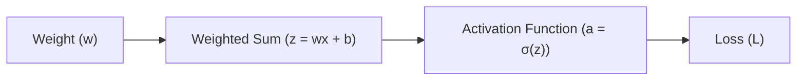

## The reading

In deep learning, neural networks learn by tweaking their weights to minimize prediction errors. This adjustment is guided by calculus—specifically, derivatives. The slope of the activation function acts as a critical gateway for this error signal during training. If this slope vanishes, the learning process stalls completely.

### 1. The Optimization Goal: Minimizing Loss
To understand why slopes matter, we must first establish the target of training:
*   **Weights ($w$):** The adjustable parameters (dials) of the neural network.
*   **Loss ($L$):** A mathematical function measuring the network's error (the difference between predictions and actual targets).

The goal of learning is to find a set of weights that minimizes $L$. To adjust a specific weight $w$ effectively, we need to calculate the **gradient of the loss with respect to that weight** ($\frac{\partial L}{\partial w}$). This derivative represents the sensitivity of the error to changes in that specific parameter:
$$\frac{\partial L}{\partial w} \approx \frac{\Delta \text{ Loss}}{\Delta \text{ Weight}}$$

### 2. The Mechanics of the Weight Update
Once we know $\frac{\partial L}{\partial w}$, we update the weight using the gradient descent formula:
$$w_{\text{new}} = w_{\text{old}} - \eta \cdot \frac{\partial L}{\partial w}$$
where $\eta$ is the learning rate (a small constant scaling the step size).

*   **If $\frac{\partial L}{\partial w}$ is positive:** Increasing the weight increases the error. Subtracting the gradient decreases the weight.
*   **If $\frac{\partial L}{\partial w}$ is negative:** Increasing the weight decreases the error. Subtracting the negative gradient increases the weight.
*   **If $\frac{\partial L}{\partial w}$ is zero:** The error does not change regardless of how we tweak the weight. The weight remains unchanged: $w_{\text{new}} = w_{\text{old}}$.

### 3. Backpropagation and the Chain Rule
A weight is positioned deep inside the network. Its influence on the final loss travels through multiple computations:
1.  **Linear Summation ($z$):** The weight is multiplied by the input $x$ and added to other inputs and bias:
    $$z = w \cdot x + b$$
2.  **Activation ($a$):** The sum $z$ is passed through the activation function $\sigma$:
    $$a = \sigma(z)$$
3.  **Loss Calculation ($L$):** The activated output $a$ (potentially after passing through more layers) is used to compute the error $L$.

To compute how a change in $w$ affects $L$, we apply the calculus **chain rule**, multiplying the rates of change step-by-step:
$$\frac{\partial L}{\partial w} = \frac{\partial L}{\partial a} \cdot \frac{\partial a}{\partial z} \cdot \frac{\partial z}{\partial w}$$

Let's look at each term:
*   $\frac{\partial L}{\partial a}$: How the error changes when the neuron's output changes.
*   $\frac{\partial a}{\partial z}$: The derivative (slope) of the activation function, written as $\sigma'(z)$.
*   $\frac{\partial z}{\partial w}$: How the weighted sum changes when the weight changes, which evaluates simply to the input $x$.

Substituting these, we get:
$$\frac{\partial L}{\partial w} = \frac{\partial L}{\partial a} \cdot \sigma'(z) \cdot x$$

### 4. Why Zero Slope Stalls Learning
The slope of the activation function, $\sigma'(z)$, acts as a multiplier in the middle of the chain. 

When an activation function saturates (flatlines), its slope $\sigma'(z)$ approaches zero. Because it is a multiplication chain, if any term in the product is zero, the entire result collapses:
$$\frac{\partial L}{\partial w} = \frac{\partial L}{\partial a} \cdot 0 \cdot x = 0$$

Under this condition:
$$w_{\text{new}} = w_{\text{old}} - \eta \cdot 0 = w_{\text{old}}$$

This mathematical collapse is the root cause of training failures like the **vanishing gradient problem** (in Sigmoid and Tanh functions) and the **dying ReLU problem**. Without a non-zero slope, the error signal cannot flow backward through the activation function, leaving the weights before it permanently stuck.

## Related Generated Readings
- [[Activation_Functions_Explained]]
- [[Comprehensive_Guide_to_Activation_Functions_and_Gradient_Flow]]

## Concepts to extract
- [x] [[Activation Functions]]
