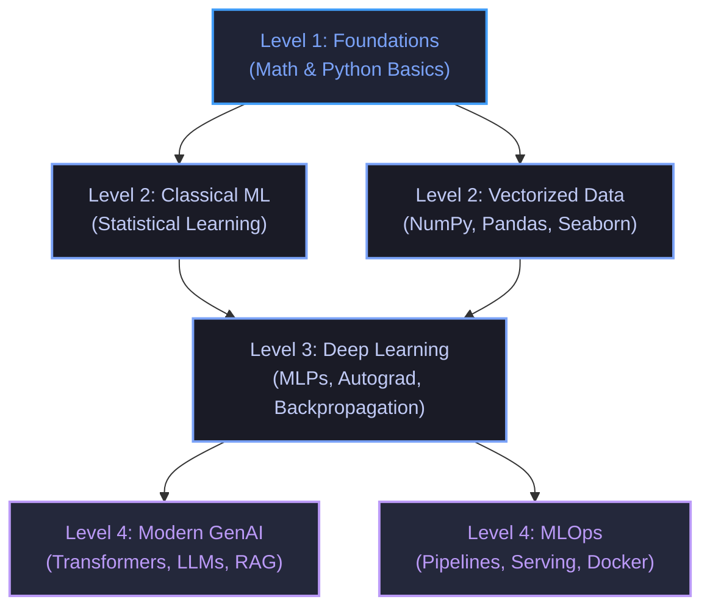

## The reading

### 1. Introduction: The Self-Paced Dependency Philosophy
Learning Machine Learning (ML) does not follow a strict calendar. For learners who prefer to flow naturally and follow their curiosity, a rigid schedule (e.g., "Months 1–3") can feel restrictive and counter-productive. 

Instead of tracking time, this roadmap is structured as a **Dependency-Based Skill Tree**. Think of it like an RPG game skill tree: you unlock "nodes" by mastering their prerequisites. You can spend as much or as little time on a node as your curiosity dictates, taking detours to build interesting projects whenever you feel inspired.

---

### 2. Level 1: Foundations (Prerequisite for Everything)
Start here to acquire the "language" of machine learning. You don't need a math degree, but you do need to understand the basic operations that occur behind the scenes.

#### 1. Mathematical Underpinnings
*   **Linear Algebra:** Learn about vectors, matrices, dot products, and matrix multiplication. Understand how dimensions must align.
    *   *Why:* Model weights are stored as matrices; inputs flow through networks as vector multiplications.
*   **Calculus:** Understand derivatives, partial derivatives, gradients, and the chain rule.
    *   *Why:* Backpropagation uses the chain rule to find how shifting weights affects the overall loss.
*   **Probability & Statistics:** Understand mean, variance, standard deviation, probability distributions (Normal, Bernoulli), Bayes' theorem, and Maximum Likelihood Estimation (MLE).
    *   *Why:* Classification outputs are modeled as probabilities; statistics underpins loss functions.

#### 2. Code Foundations
*   **Python:** Syntax, loops, list comprehensions, dicts, generators, functions, and OOP basics.
*   **Mathematical Visualization:** How to plot data with Matplotlib or Seaborn.

#### Key Resources
*   *Essence of Linear Algebra* & *Essence of Calculus* (YouTube - 3Blue1Brown)
*   *Mathematics for Machine Learning and Data Science Specialization* (DeepLearning.AI / Coursera)
*   *MIT 18.06: Linear Algebra* by Gilbert Strang (MIT OpenCourseWare)

---

### 3. Level 2: Core Data Handling & Classical Machine Learning
*Prerequisites: Level 1 Foundations*

Once you understand the math and Python, split your time between learning how to manipulate datasets and how classical prediction models work.

#### 1. Vectorized Data Handling (Numerical Python)
*   **NumPy:** Master array operations, slicing, broadcasting, and vectorization.
    *   *Mechanism:* Python loops are slow. NumPy uses contiguous memory layouts in C to compute operations on millions of points simultaneously.
*   **Pandas:** Master dataframes, cleaning missing values, grouping, and aggregations.

#### 2. Classical Machine Learning Models
*   **Preprocessing:** Standardization (Z-score to mean 0, variance 1) vs. Normalization (MinMax to `[0, 1]`), and One-Hot encoding.
*   **Evaluation:** Bias-Variance Tradeoff, Train-Test splits, and K-Fold Cross-Validation.
*   **Regularization:** L1 (Lasso - forces features to zero for automatic selection) vs. L2 (Ridge - penalizes large weights).
*   **Algorithms:** Linear & Logistic Regression, Decision Trees, Random Forests, Gradient Boosted Trees (XGBoost, LightGBM), SVMs, PCA, and K-Means.

#### Recommended Milestone Projects
*   **Gradient Descent from Scratch:** Implement simple Linear Regression in pure Python and NumPy to fit a line to random data.
*   **Hyperparameter Optimizer:** Build a Scikit-Learn pipeline to predict housing prices using an XGBoost model, running a grid search to find the best configuration.

#### Key Resources
*   *Machine Learning Specialization* (Andrew Ng / Coursera)
*   *Hands-On Machine Learning with Scikit-Learn, Keras, and TensorFlow* (Aurélien Géron, Chapters 1-9)
*   *Introduction to Statistical Learning (ISL)* (Gareth James et al.)

---

### 4. Level 3: Deep Learning Foundations
*Prerequisites: Level 2 Classical ML + Vectorized Data*

Move from static models to neural networks that learn representations automatically.

#### 1. Neural Network Architecture
*   **Multi-Layer Perceptrons (MLPs):** Input, hidden, and output layers.
*   **Activation Functions:** ReLU (fixes vanishing gradients), Sigmoid (maps outputs to `[0, 1]`), and Softmax (creates probability distributions).
*   **Backpropagation:** How gradients flow backward through network nodes via the chain rule to update weights.
*   **Optimizers:** Adam, SGD, and momentum.

#### 2. Applied Deep Learning Frameworks
*   **PyTorch:** Master `torch.Tensor` operations, dynamic computation graphs, autograd (automatic differentiation), and subclassing `nn.Module` to build layers.
*   **Architectures:** CNNs (Convolutional layers for image features) and RNNs/LSTMs (recurrent layers for sequential sequences).

#### Recommended Milestone Projects
*   **micrograd Clone:** Implement a tiny autograd engine from scratch in Python to build and train a basic neural network.
*   **MNIST Image Classifier:** Train a custom PyTorch CNN to recognize handwritten digits.

#### Key Resources
*   *Neural Networks: Zero to Hero* (YouTube - Andrej Karpathy)
*   *Practical Deep Learning for Coders* (fast.ai)

---

### 5. Level 4: Specializations (Follow Your Curiosity)
*Prerequisites: Level 3 Deep Learning*

Here, the path branches. You can follow either or both branches depending on what excites you.

#### Branch A: Modern Generative AI & Transformers (NLP Focus)
*   **Transformers:** Self-Attention mechanism, tokenization (BPE/SentencePiece), Positional Encodings.
*   **LLM Engineering:** Fine-tuning (PEFT/LoRA/QLoRA), instruction tuning (RLHF/DPO), and Prompt Engineering.
*   **Applications:** Retrieval-Augmented Generation (RAG) using vector databases (Chroma, FAISS) and multi-agent loops.
*   *Milestone Project:* Build a GPT decoder network in PyTorch from scratch, train it on Shakespeare text, and build a local RAG chat system.
*   *Resources:* Karpathy's "Let's build GPT", Hugging Face NLP Course, Maxime Labonne's LLM Course.

#### Branch B: MLOps & Production Systems (Engineering Focus)
*   **Tracking:** Logging loss curves, hyperparameters, and model versions with MLflow or Weights & Biases.
*   **Serving:** Wrapping PyTorch models in web APIs (FastAPI).
*   **Infrastructure:** Containerizing systems using Docker, deploying models to cloud platforms (AWS, GCP).
*   **Monitoring:** Detecting Data Drift and Concept Drift over time.
*   *Milestone Project:* Package your MNIST image classifier into a FastAPI service, build a Docker image, and deploy it as a public web API.
*   *Resources:* *Designing Machine Learning Systems* by Chip Huyen, MLOps Zoomcamp (DataTalks.Club).

---

## Concepts to extract
- [ ] [[Machine Learning Roadmap]]
- [ ] [[Bottom-Up vs. Top-Down Learning]]
- [ ] [[Vectorization in NumPy]]
