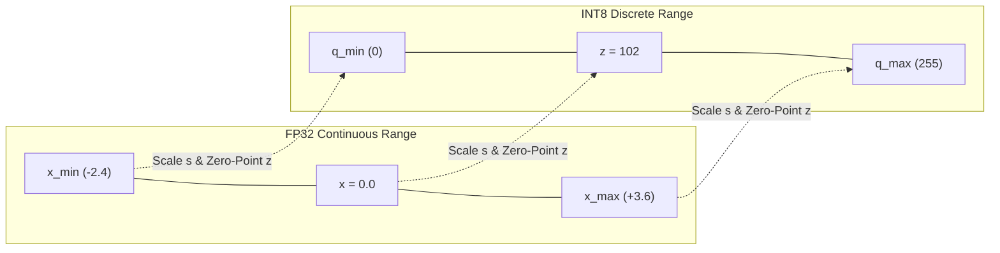
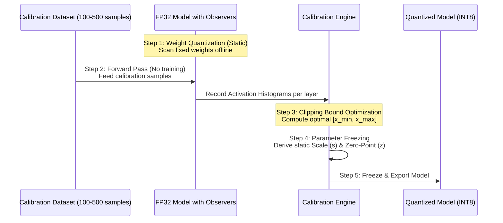

## The reading

**Post-Training Quantization (PTQ)** is a model compression methodology that converts high-precision floating-point parameters and layer activations (typically 32-bit `FP32` or 16-bit `FP16`/`BF16`) into lower-precision discrete integer formats (such as 8-bit `INT8` or 4-bit `INT4`) after model training has completed. By leveraging offline affine linear mappings—defined by scale factors ($s$) and zero-points ($z$)—and static activation calibration, PTQ reduces memory footprint by up to $75\%$, lowers DRAM bandwidth traffic, and enables fast integer arithmetic on edge accelerators and hardware Tensor Cores without requiring full model retraining.

---

### 1. Motivation: The Compute and Memory Bottlenecks of FP32

Modern deep neural networks rely heavily on 32-bit floating-point numbers (`FP32`) during training to preserve fine-grained gradient updates. However, deploying `FP32` models to production—especially on edge devices (smartphones, IoT devices, microcontrollers) or high-throughput cloud inference servers—presents severe hardware constraints:

1. **Storage and Memory Footprint:** Each `FP32` parameter consumes 4 bytes of storage. A 7-billion parameter Large Language Model (LLM) requires approximately $28\text{ GB}$ of VRAM just to load its weights into memory, rendering it unfeasible for standard edge devices.
2. **Memory Bandwidth Bottleneck:** In modern hardware architectures, moving data between off-chip DRAM and processing units (ALUs/Tensor Cores) consumes orders of magnitude more energy and latency than executing arithmetic operations. Fetching 32-bit values continuously starves processing cores.
3. **Compute Efficiency:** `FP32` floating-point units (FPUs) are larger and consume significantly more clock cycle energy than integer processing units (`INT8`/`INT4` ALUs).

Quantization addresses these bottlenecks by mapping continuous high-precision real values onto a compact, discrete integer grid.

---

### 2. Architectural Comparison: PTQ vs. QAT

Quantization techniques are broadly divided into two operational paradigms based on when and how the precision reduction occurs:

| Dimension | Post-Training Quantization (PTQ) | Quantization-Aware Training (QAT) |
| :--- | :--- | :--- |
| **Execution Phase** | Post-hoc (after training is complete) | During training / fine-tuning loop |
| **Compute Requirement** | Low (minutes on a standard CPU/GPU) | High (requires full gradient descent retraining) |
| **Data Requirement** | Tiny calibration dataset (100–500 samples) | Full training dataset |
| **Mechanism** | Offline parameter scanning & forward-pass calibration | Inserts fake-quantization nodes into graph to model rounding error during forward/backward passes |
| **Best Used For** | Fast deployment, limited compute budget, standard `INT8` model compression | Extreme low-precision targets (e.g., 2-bit/3-bit), severe precision loss recovery |

---

### 3. Mathematical Foundations: Scale Factor ($s$) and Zero-Point ($z$)

Quantization relies on an affine linear mapping that projects a continuous real-valued range $[x_{\min}, x_{\max}]$ onto a discrete integer range $[q_{\min}, q_{\max}]$ (e.g., $[0, 255]$ for unsigned `INT8`, or $[-128, 127]$ for signed `INT8`).

#### Mapping Equations
To convert a floating-point real number $x$ into its quantized integer representation $x_q$:
$$x_q = \text{clamp}\left( \text{round}\left( \frac{x}{s} \right) + z, \, q_{\min}, \, q_{\max} \right)$$

To reconstruct a floating-point approximation $\hat{x}$ during mathematical operations (dequantization):
$$\hat{x} = s \cdot (x_q - z)$$

#### Deriving Scale Factor ($s$) and Zero-Point ($z$)
The **Scale Factor ($s$)** represents the step size of each discrete integer bucket:
$$s = \frac{x_{\max} - x_{\min}}{q_{\max} - q_{\min}}$$

The **Zero-Point ($z$)** is an integer in the target quantized range that maps precisely to the real value $0.0$:
$$z = \text{round}\left( q_{\min} - \frac{x_{\min}}{s} \right)$$

#### The Role of Zero-Point ($z$)
Mapping real $0.0$ to an exact integer index $z$ is vital for neural networks due to:
- **Zero-Padding:** Convolutional layers pad input edges with exact zeros. Without an exact integer zero, padding introduces artificial bias across layers.
- **Sparsity in Activations:** Activation functions like `ReLU` force all negative values to exactly $0.0$. Exact zero representation preserves activation sparsity without introducing numerical drift.

#### Symmetric vs. Asymmetric Quantization

| Feature | Asymmetric (Affine) Quantization | Symmetric Quantization |
| :--- | :--- | :--- |
| **Zero-Point ($z$)** | Integer variable within target range | Fixed exactly at $z = 0$ |
| **Floating-Point Range** | Direct mapping $[x_{\min}, x_{\max}]$ | Symmetric bounds $[-R, R]$, where $R = \max(|x_{\min}|, |x_{\max}|)$ |
| **Integer Range** | Full range (e.g., $[0, 255]$ or $[-128, 127]$) | Signed symmetric range (e.g., $[-127, 127]$) |
| **Hardware Efficiency** | Lower (requires computing scalar offsets $z$ during matrix multiplication) | Higher (eliminates $z$, allowing SIMD hardware & Tensor Cores to execute raw dot-products) |

---

### 4. The 5-Step End-to-End PTQ Workflow

#### Step 1: Static Weight Quantization
Because model weights ($W$) are static frozen parameters after training, their scale factors ($s_w$) and zero-points ($z_w$) are calculated offline immediately by scanning weight matrices across the network. Weight quantization can be applied:
- **Per-Tensor:** A single scale and zero-point shared across an entire weight tensor.
- **Per-Channel (Per-Axis):** Dedicated scale factors and zero-points for each output channel or convolutional kernel, mitigating accuracy loss when weight magnitudes vary widely across channels.

#### Step 2: Observer Attachment & Forward Pass
Layer activations ($A$) are dynamic values computed on the fly during inference. Because activation ranges depend on input data, we attach statistical "observer" hooks to layer outputs and execute a forward pass using a small **calibration dataset** (100–500 representative input samples). No gradients are computed and no weights are updated.

#### Step 3: Activation Clipping Bound Optimization
Setting activation bounds $[x_{\min}, x_{\max}]$ to absolute min/max recorded values causes accuracy degradation if statistical outliers exist (e.g., a single activation spike at $100.0$ stretches step size $s$ and squashes precision for $99.9\%$ of values). Calibration engines apply clipping strategies:

| Strategy | Optimization Criterion | Trade-offs |
| :--- | :--- | :--- |
| **Min-Max** | Absolute extremes: $x_{\min} = \min(A), x_{\max} = \max(A)$ | Fast, simple; vulnerable to outlier-driven precision degradation. |
| **MSE Minimization** | Finds threshold $\alpha$ minimizing $L_2$ error: $\arg\min_{\alpha} \| A - \hat{A}(\alpha) \|_2^2$ | Balances clipping loss (truncating outliers) against rounding noise (bin resolution). |
| **Entropy (KL-Divergence)** | Minimizes information loss: $\arg\min D_{\text{KL}}(P_{\text{FP32}} \| Q_{\text{INT8}})$ | Preserves activation probability distribution shape. Standard in NVIDIA TensorRT. |

#### Step 4: Parameter Calculation and Freezing
Using optimal clipping bounds $[x_{\min}, x_{\max}]$, scale factors ($s_a$) and zero-points ($z_a$) are derived for activations across all layers.

#### Step 5: Graph Transformation & Model Export
Observers are detached, floating-point layer nodes are replaced with integer matrix-multiplication kernels carrying frozen scale/zero-point parameters, and the final quantized graph is exported (e.g., `.tflite`, ONNX, TensorRT engine).

---

### 5. Flavors of PTQ in Practice

Depending on hardware support, PTQ is deployed in three common framework configurations:

1. **Dynamic Range Quantization:**
   - Weights are stored in `INT8` offline ($4\times$ memory reduction).
   - Activations remain in `FP32`. At runtime, weights are dynamically converted back to floating-point during matrix multiplication.
   - Requires no calibration dataset, but latency reduction is limited.
2. **Float16 Quantization:**
   - Downscales weights to 16-bit floating-point (`FP16`).
   - Cuts memory footprint by $50\%$ ($2\times$) with virtually zero precision loss on GPU/NPU hardware with native FP16 support.
3. **Full Integer Quantization:**
   - Both weights and activations are fully quantized to `INT8`.
   - Requires a calibration pass; delivers maximum throughput, lowest latency, and unlocks execution on integer-only hardware (e.g., ARM Cortex-M, Ethos NPU).

---

### 6. Advanced Error Mitigation for LLMs

Massive architectures like Large Language Models (LLMs) exhibit systematic high-magnitude activation outliers in specific channels, causing accuracy degradation under standard `INT8` or `INT4` PTQ. Advanced mitigation techniques solve this:

- **Bias Correction:** Adjusts layer bias vectors post-calibration to offset systematic mean shift:
  $$b_{\text{new}} = b_{\text{old}} + (\mu_{\text{FP32}} - \mu_{\text{INT8}})$$
- **SmoothQuant:** Mathematically redistributes quantization difficulty from activations to weights using per-channel scaling factors $s_j$:
  $$Y = (A \cdot \text{diag}(s)^{-1}) \cdot (\text{diag}(s) \cdot W)$$
- **GPTQ (Second-Order Hessian Optimization):** Quantizes weights column-by-column, using the inverse Hessian matrix $H^{-1}$ to update remaining unquantized weights and minimize output error, enabling `INT4` weight-only LLM quantization.
- **AWQ (Activation-Aware Weight Quantization):** Identifies the top $1\%$ salient weight channels corresponding to high-magnitude activations, selectively protecting them via scaling.

---

## Concepts to extract
- [x] [[Post-Training Quantization]]
- [x] [[Scale Factor and Zero-Point]]
- [x] [[Quantization Calibration]]
