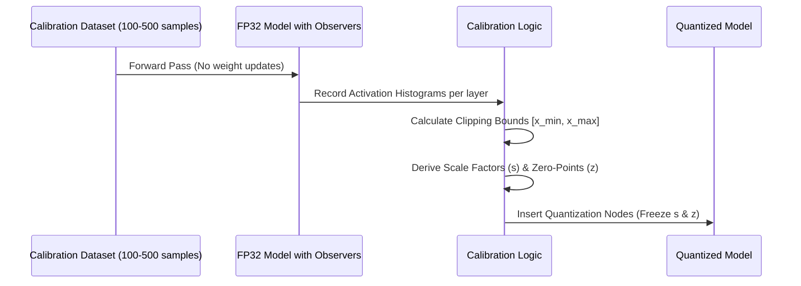

## The reading

In Post-Training Quantization (PTQ), **calibration** is the process of estimating the typical range of dynamic activation values across each layer of a neural network. This allows the quantization algorithm to compute optimal scale factors and zero-points for activations before deploying the model.

---

### 1. The Core Problem: Static Weights vs. Dynamic Activations
To understand why calibration is necessary, we must distinguish between the two types of numbers processed by a neural network:

1.  **Model Weights ($W$):** Weights are static parameters. They are fixed at the end of training and do not change. We can compute their scale factor ($s$) and zero-point ($z$) immediately by scanning the weight matrices offline.
2.  **Layer Activations ($A$):** Activations are dynamic. They are computed on the fly as inputs flow through the network. The ranges of these values depend entirely on the input data fed to the model. 

Because we do not know the exact values activations will take during inference, we cannot determine their quantization parameters in advance. We must estimate their typical distributions using calibration.

---

### 2. The Calibration Workflow

The calibration phase follows these sequential steps:
1.  **Data Selection:** A small, representative subset of the training or validation data (typically 100 to 500 samples) is gathered. This is the **calibration dataset**.
2.  **Forward Pass Observation:** The calibration data is fed forward through the floating-point model. No gradients are calculated, and no weights are updated. Instead, temporary "observers" or "hooks" monitor the activations at each layer.
3.  **Histogram Collection:** The observers compile statistical histograms of the activation values at the output of every convolutional or fully connected layer.
4.  **Clipping Bound Calculation:** An optimization algorithm analyzes the histograms to determine the ideal lower and upper clipping bounds ($x_{\min}$ and $x_{\max}$) for the activations.
5.  **Parameter Freezing:** The scale factor ($s$) and zero-point ($z$) are computed using the derived bounds and written into the model's metadata. The observers are then removed, leaving a fully quantized network ready for inference.

---

### 3. Activation Clipping Strategies
Setting the clipping bounds ($x_{\min}$ and $x_{\max}$) directly to the absolute minimum and maximum values observed during calibration is rarely optimal due to **outliers**. 

If $99.9\%$ of activations fall between $0.0$ and $1.0$, but a single outlier spikes to $100.0$, scaling for the full range squashes the precision of the remaining $99.9\%$ of values into a tiny integer range. To prevent this, three main clipping strategies are used:

| Strategy | Mathematical Goal | Pros & Cons |
| :--- | :--- | :--- |
| **Min-Max** | Set bounds to absolute extremes: $x_{\min} = \min(A)$ $x_{\max} = \max(A)$ | **Pros:** Simplest and fastest. **Cons:** Highly sensitive to outliers; stretches step size $s$ and degrades precision. |
| **MSE Minimization** | Find clipping threshold $\alpha$ that minimizes the L2 loss between original activations ($A$) and quantized/dequantized approximations ($\hat{A}$): $\arg\min_{\alpha} \| A - \hat{A}(\alpha) \|_2^2$ | **Pros:** Mathematically balances truncation error (clipping outliers) against rounding noise (quantization precision). Highly robust. |
| **Entropy (KL-Divergence)** | Treats FP32 activations as a probability distribution $P$ and quantized values as distribution $Q$. Minimizes information loss: $\arg\min D_{KL}(P \| Q)$ | **Pros:** Preserves the underlying shape of the activation distribution. Standard implementation in NVIDIA TensorRT. |

---

### 4. Why Calibration Quality Matters
Because PTQ avoids retraining, the quality of the calibration dataset is the primary factor determining model accuracy post-quantization:
*   **Out-of-Distribution Data:** If the calibration dataset does not reflect real-world inputs (e.g., calibrating an autonomous vehicle vision model using only sunny daytime images, then deploying it in heavy rain), the recorded activation ranges will be incorrect, resulting in severe accuracy drop.
*   **Dataset Size:** A dataset that is too small (e.g., $<50$ samples) may fail to cover the model's normal activation range, leading to clipping boundaries that are too narrow and causing excessive information loss.

## Related Generated Readings
- [[Scale_Factor_and_Zero_Point_in_Quantization]]
- [[Post_Training_Quantization_End_to_End_Guide]]
- [[Activation_Functions_Explained]]

## Concepts to extract
- [x] [[Quantization Calibration]]
