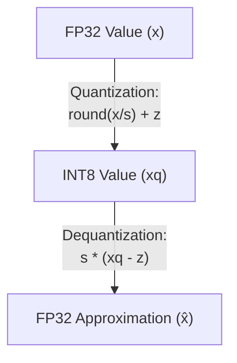

## The reading

In deep learning quantization, the **scale factor ($s$)** and the **zero-point ($z$)** are the two mathematical parameters used to map high-precision floating-point numbers (usually 32-bit `FP32`) into low-precision integers (usually 8-bit `INT8` or 4-bit `INT4`). 

Together, they establish a bridge between continuous real numbers and a discrete grid of integers.

---

### 1. Intuitive Analogy: The Ruler and the Digital Grid
Imagine you have a highly detailed physical ruler that measures distance in millimeters (analogous to high-precision `FP32`). The physical coordinates on your object range from $-24$ mm to $+36$ mm.

You want to map these physical coordinates onto a low-resolution digital screen that has only 8 pixels, indexed from $0$ to $7$ (analogous to a 3-bit integer representation). 

To do this, you need to answer two questions:
1.  **How wide is each pixel? (Scale Factor)**
    The total span of your physical coordinate is $36 - (-24) = 60$ mm. You have 7 intervals between your 8 pixels. Therefore, each pixel must span:
    $$s = \frac{60 \text{ mm}}{7} \approx 8.57 \text{ mm per pixel}$$
    This step size is the **Scale Factor ($s$)**.
2.  **Where does the physical $0.0$ mark land? (Zero-Point)**
    Physical $-24$ mm maps to pixel index $0$. Moving forward, physical $0.0$ mm lands at:
    $$z = 0 - \frac{-24 \text{ mm}}{8.57 \text{ mm}} \approx 2.8 \approx 3$$
    This pixel index is the **Zero-Point ($z$)**. Pixel index $3$ represents exactly $0.0$ mm in the physical world.

---

### 2. Mathematical Formulations

#### The Mapping Equation
To convert a real number $x$ to its quantized integer representation $x_q$, we use the quantization formula:
$$x_q = \text{clamp}\left( \text{round}\left( \frac{x}{s} \right) + z, \, q_{\min}, \, q_{\max} \right)$$
Where $[q_{\min}, q_{\max}]$ is the range of the target integer format (e.g., $[0, 255]$ for unsigned INT8, or $[-128, 127]$ for signed INT8).

To map the quantized integer back to an approximation of the original float value $\hat{x}$, we use:
$$\hat{x} = s \cdot (x_q - z)$$

#### Calculating the Scale Factor ($s$)
The scale factor is a positive floating-point number that represents the step size of the quantization grid:
$$s = \frac{x_{\max} - x_{\min}}{q_{\max} - q_{\min}}$$
Where $[x_{\min}, x_{\max}]$ is the range of real values present in the tensor.

#### Calculating the Zero-Point ($z$)
The zero-point is an integer in the target quantized range that corresponds exactly to the real value $0.0$:
$$z = \text{round}\left( q_{\min} - \frac{x_{\min}}{s} \right)$$

---

### 3. Why the Zero-Point is Crucial
It might seem simpler to just scale the numbers without shifting them. However, having a dedicated zero-point ($z$) that maps precisely to $0.0$ is critical for deep learning networks:
*   **Zero-Padding:** Many neural network architectures pad inputs with zeros (e.g., in convolutional layers to maintain spatial dimensions). If zero cannot be represented exactly, the padding introduces systematic bias/noise.
*   **Threshold Activations:** Activation functions like ReLU set all negative inputs to exactly $0.0$. If zero is mapped to a non-integer value, rounding errors will cause small positive values to become negative (or vice-versa), modifying the sparsity patterns and degrading model accuracy.

---

### 4. Symmetric vs. Asymmetric Quantization

Quantization algorithms configure the zero-point in one of two ways:

| Feature                 | Asymmetric Quantization                                                            | Symmetric Quantization                                                                        |
| :---------------------- | :--------------------------------------------------------------------------------- | :-------------------------------------------------------------------------------------------- |
| **Zero-Point ($z$)**    | Can be any integer within the target range.                                        | Fixed exactly at $0$.                                                                         |
| **Float Range**         | Maps $[x_{\min}, x_{\max}]$ directly.                                              | Maps a symmetric range $[-R, R]$, where $R = \max(x_{\min},x_{\max})$.                        |
| **Integer Range**       | Full range (e.g., $[0, 255]$ or $[-128, 127]$).                                    | Signed symmetric range (e.g., $[-127, 127]$).                                                 |
| **Hardware Efficiency** | Lower. Requires computing cross-terms like $z_w x_q$ during matrix multiplication. | Higher. Since $z = 0$, offsets cancel out, letting integer Tensor Cores run raw dot-products. |

During inference, weights are typically quantized **symmetrically** to speed up hardware execution, whereas dynamic activations (which are often strictly positive, like after a ReLU) are quantized **asymmetrically** to preserve precision.

## Related Generated Readings
- [[Quantization_Calibration_in_PTQ]]
- [[Post_Training_Quantization_End_to_End_Guide]]
- [[Activation_Functions_Explained]]

## Concepts to extract
- [x] [[Scale Factor and Zero-Point]]
