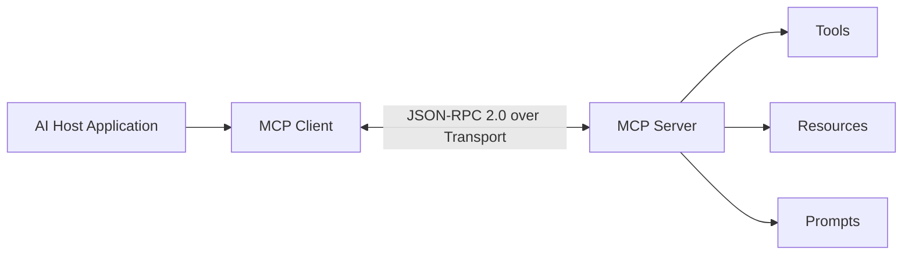

# Model Context Protocol (MCP) Architecture & Specification

The **Model Context Protocol (MCP)** is an open standard that standardizes how Artificial Intelligence models and host applications securely connect to external tools, databases, and context providers. By replacing fragmented, bespoke per-tool integrations with a universal client-host-server protocol powered by [[JSON-RPC 2.0]], MCP solves the $N \times M$ integration bottleneck across AI host environments (such as IDEs, desktop applications, and CLI agents) and external systems.

## 1. Core Architectural Model

MCP uses a decoupled architecture with three distinct actors:
- **Host Application**: The parent AI application (e.g., Claude Desktop, Antigravity IDE) that coordinates user interactions, manages security permissions, and orchestrates client instances.
- **MCP Client**: A lightweight process instantiated inside the Host to maintain a dedicated 1:1 connection with a target MCP Server.
- **MCP Server**: An independent program exposing specific data sources and dynamic capabilities via standard primitives.

## 2. Standardized Primitives

MCP servers expose three fundamental building blocks to the client:

### A. Tools (Executable Functions)
- Model-controlled actions that allow AI agents to perform side effects (e.g., executing terminal commands, creating files, querying databases).
- Invoked via `tools/call` requests with strict JSON schemas.

### B. Resources (Data Feeds & Context)
- Read-only data sources attached to URI schemes (e.g., `file://`, `db://`, `git://`).
- Allows hosts to inject dynamic context directly into the prompt window.

### C. Prompts (Workflow Templates)
- User-selectable or agent-guided prompt templates that parameterize complex multi-step workflows.

## 3. Protocol & Transport Layers

The MCP specification decouples message semantics from physical transport mechanics:

- **Data Layer**: Implements **JSON-RPC 2.0** for requests, responses, and notification events.
- **Transport Layer**:
  - **Stdio Transport**: Uses standard input/output (`stdin`/`stdout`) for locally managed server subprocesses.
  - **SSE Transport**: Uses Server-Sent Events over HTTP for remote or cloud-hosted MCP services.

## 4. Derived Concepts & Linkages

- [[Model_Context_Protocol]]: Atomic concept definition for the universal context protocol.
- [[JSON_RPC_2_0]]: Transport-agnostic messaging format used across MCP data layers.
