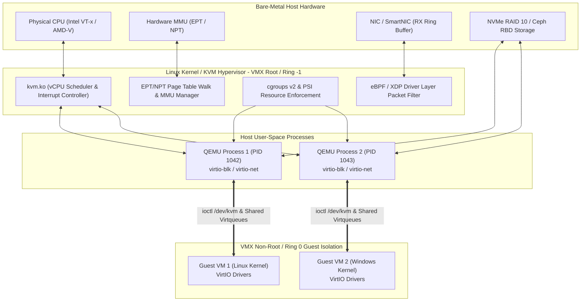
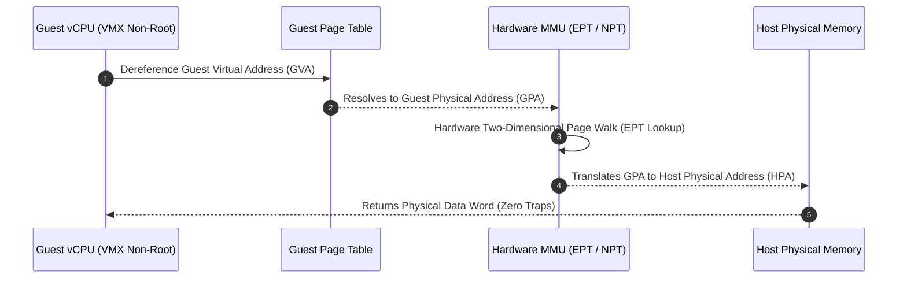
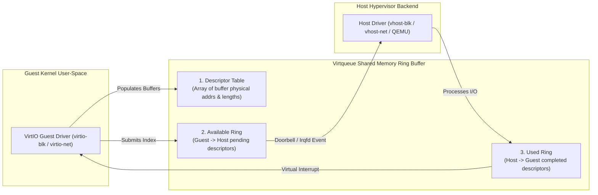
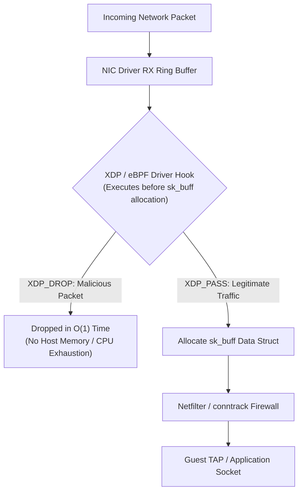
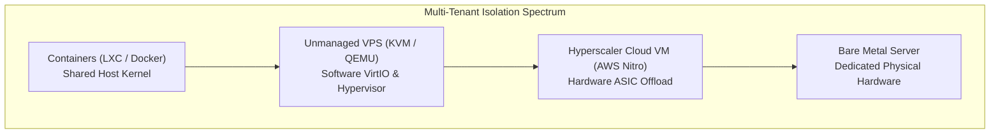

## The reading

A **Virtual Private Server (VPS)** is an isolated, multi-tenant virtual execution environment created by partitioning physical server hardware using a hypervisor (Virtual Machine Monitor / VMM) or kernel-level OS namespaces. Modern cloud VPS infrastructure relies on hardware-assisted CPU/MMU virtualization extensions (Intel VT-x/EPT, AMD-V/NPT), paravirtualized I/O frameworks (OASIS VirtIO), intelligent memory and CPU overcommitment (cgroups v2, KSM, virtio-balloon), and high-throughput network filtering (eBPF/XDP) to provide tenants with sovereign virtual hardware—vCPUs, virtual RAM, storage volumes, and network interfaces—while maintaining rigid multi-tenant security boundaries and near-native computational performance.



---

### 1. Fundamentals of Virtual Private Servers & Hypervisor Classification

Virtualization operates across two fundamental paradigms: **Hardware-Level Virtualization** (full hypervisors executing distinct guest kernels) and **Operating System-Level Virtualization** (containers multiplexing a single host kernel). Within hardware virtualization, hypervisors are categorized by their position relative to bare-metal hardware:

- **Type-1 (Bare-Metal / Native) Hypervisors**: Run directly on bare-metal physical hardware without an underlying host operating system. The hypervisor operates in privileged hardware execution states (Intel VMX Root / AMD SVM Host Mode, informally Ring -1), retaining direct control over CPU scheduling, physical memory mapping, and hardware interrupts. Examples include VMware ESXi, Xen Hypervisor, and Linux KVM.
- **Type-2 (Hosted) Hypervisors**: Run as standard user-space application processes on top of a conventional host OS (e.g., Oracle VirtualBox, VMware Workstation). They suffer from "double scheduling" overhead because the host OS kernel schedules hypervisor application threads, which in turn schedule guest vCPUs.

```
+------------------------------------+      +------------------------------------+
|  Type-1 Bare-Metal Hypervisor      |      |  Type-2 Hosted Hypervisor          |
|  (e.g., Xen, ESXi, KVM*)           |      |  (e.g., VirtualBox, Workstation)   |
+------------------------------------+      +------------------------------------+
| [Guest VM 1] [Guest VM 2]          |      | [Guest VM 1] [Guest VM 2]          |
| [Guest Kernel][Guest Kernel]       |      | [Guest Kernel][Guest Kernel]       |
+------------------------------------+      +------------------------------------+
| Hypervisor / VMM Layer             |      | Hypervisor App (User-space)        |
| (Runs in Ring -1 / VMX Root)       |      +------------------------------------+
+------------------------------------+      | Host Operating System Kernel       |
| Bare-Metal Hardware (CPU/RAM/Disk) |      +------------------------------------+
+------------------------------------+      | Bare-Metal Hardware (CPU/RAM/Disk) |
                                            +------------------------------------+
* Note: KVM converts the Linux kernel itself into a Type-1 bare-metal hypervisor module.
```

#### Kernel-Based Virtual Machine (KVM) Architecture
KVM turns the Linux kernel into a bare-metal hypervisor via kernel modules (`kvm.ko` and architecture-specific `kvm-intel.ko` / `kvm-amd.ko`). In the KVM model:
1. The host user-space process (QEMU) opens `/dev/kvm` and executes `ioctl(KVM_CREATE_VM)`.
2. QEMU maps guest memory ranges via `ioctl(KVM_SET_USER_MEMORY_REGION)`.
3. QEMU spawns a standard POSIX thread per vCPU and executes `ioctl(KVM_RUN)`.
4. KVM switches CPU execution into **VMX Non-Root Mode**. Guest instructions execute natively at full hardware speed until a sensitive instruction or interrupt triggers a hardware **VM Exit**.

#### Xen Microkernel Architecture
Xen uses a microkernel hypervisor running in Ring -1 that manages raw hardware interrupts and CPU scheduling, but contains no native hardware device drivers. Isolation is split between:
- **Dom0 (Domain 0)**: A privileged administrative Linux/BSD virtual machine holding native hardware drivers, managing host storage/networking, and running control toolstacks (`xl`, `xenstore`).
- **DomU (Domain U)**: Unprivileged guest VMs isolated from physical hardware. DomU instances execute I/O by passing messages to Dom0 backends via **Grant Tables** (shared memory page descriptors) and **Event Channels** (virtual interrupts).

---

### 2. Hardware-Assisted CPU & Memory Virtualization Mechanics

Prior to hardware virtualization extensions, x86 virtualization relied on complex software mechanisms such as **Binary Translation** (rewriting non-virtualizable Ring 0 instructions like `POPF`, `CLI`) or **Paravirtualization** (modifying guest kernel code to issue hypercalls). Modern CPUs incorporate native hardware virtualization extensions:

#### Hardware Execution Modes & Control Structures
- **Intel VT-x & AMD-V**: Introduce two distinct operating modes:
  - *VMX Root Operation*: Privileged hypervisor execution mode where all CPU instructions execute normally.
  - *VMX Non-Root Operation*: Restricted guest execution mode. Instructions attempting to modify hardware control registers (`CR0`, `CR3`, `CR4`), execute physical I/O, or manage interrupt tables trigger an immediate hardware **VM Exit**, handing control back to the hypervisor.
- **Virtual Machine Control Structure (VMCS - Intel) / Control Block (VMCB - AMD)**: A 4KB physical memory structure configured per vCPU containing:
  1. *Guest-State Area*: Saved guest registers (`CR0/CR3/CR4`, `RSP`, `RIP`, `RFLAGS`, segment selectors).
  2. *Host-State Area*: Hypervisor context loaded automatically during VM exits.
  3. *VM-Execution Controls*: Bitmasks defining which instructions or hardware events cause VM exits.
  4. *VM-Exit Information Fields*: Detailed exit reason codes and qualification data.

#### Second Level Address Translation (SLAT): Intel EPT & AMD NPT
In early software virtualization, hypervisors maintained **Shadow Page Tables (SPT)** to translate Guest Virtual Addresses (GVA) directly to Host Physical Addresses (HPA), requiring traps on every guest page table modification. SLAT moves two-dimensional memory address translation directly into the hardware Memory Management Unit (MMU):

$$\text{Guest Virtual Address (GVA)} \xrightarrow{\text{Guest Page Table}} \text{Guest Physical Address (GPA)} \xrightarrow{\text{EPT / NPT}} \text{Host Physical Address (HPA)}$$



- **Performance Gain**: Eliminates shadow page table traps, reducing memory virtualization overhead from ~20–30% down to <2–3%.
- **TLB Tagging (VPID / ASID)**: Hardware tags Translation Lookaside Buffer (TLB) entries with Virtual Processor IDs (VPID on Intel, ASID on AMD). This allows TLB entries to persist across VM entries and exits, avoiding mandatory TLB flushes during context switches.

---

### 3. Resource Allocation, Overcommitment & Telemetry

Hosting providers optimize infrastructure unit economics by overcommitting CPU and RAM resources across tenant VMs using dynamic scheduling, ballooning, memory deduplication, and cgroups resource limits.

#### A. vCPU Scheduling & Oversubscription
- **vCPU Pinning & NUMA Alignment**: Standard vCPU threads migrate dynamically across physical host cores (`pCPUs`), causing L1/L2 cache invalidations and cross-socket NUMA bus latency. Static vCPU pinning via `virsh vcpupin` or `<cputune>` XML binds specific vCPUs to physical NUMA cores:
  ```xml
  <cputune>
    <vcpupin vcpu='0' cpuset='4'/>
    <vcpupin vcpu='1' cpuset='5'/>
  </cputune>
  ```
- **Oversubscription Ratios**:
  - *Dedicated Compute*: 1:1 vCPU-to-pCPU ratio (zero overcommit) for high-performance databases.
  - *Standard VPS*: 3:1 to 5:1 ratio, taking advantage of asynchronous CPU usage patterns across tenants.
  - *Burstable Tier*: Up to 10:1 ratio, capped via cgroups CPU quotas (`cpu.max = "200000 100000"` allowing 2 vCPUs per 100ms period).

#### B. RAM Overcommitment & Deduplication
- **VirtIO Balloon Driver (`virtio-balloon`)**:
  - *Inflation*: The hypervisor commands the guest balloon driver to allocate memory pages inside the guest OS. The guest kernel reclaims page cache or swaps out guest processes, returning physical memory frames back to the host hypervisor pool.
  - *Deflation*: The hypervisor releases physical pages back to the guest during memory-intensive operations.
- **Kernel Samepage Merging (KSM)**:
  - The background host kernel daemon (`ksmd`) periodically scans anonymous user-space memory marked with `madvise(MADV_MERGEABLE)`.
  - It compares page contents; identical memory pages (e.g., duplicate OS libraries across guest VMs) are merged into a single, write-protected Copy-On-Write (COW) physical page frame, increasing VM tenant density by up to 300%.

#### C. Linux cgroups v2 & Pressure Stall Information (PSI)
- **cgroups v2 Resource Hierarchy**: Enforces a unified single hierarchy with leaf-only process placement:
  - `cpu.max`: Restricts maximum CPU bandwidth (quota and period).
  - `memory.high` / `memory.max`: Sets proactive reclaim throttling and hard OOM-killer limits.
  - `io.max`: Enforces read/write Bytes-per-Second (`rbps`/`wbps`) and IOPS (`riops`/`wiops`) limits on host block devices.
- **Pressure Stall Information (PSI)**: Monitors multi-tenant health by measuring wall-clock time tasks spend waiting for CPU, Memory, or I/O:
  - `some`: Percentage of time at least one task was stalled waiting for resources.
  - `full`: Percentage of time *all* active tasks were blocked, indicating severe noisy-neighbor resource starvation.

---

### 4. Storage & Network Paravirtualization Architecture

Rather than emulating physical hardware registers (such as an Intel e1000 NIC or IDE disk controller), modern VPS systems utilize **paravirtualization**—exposing optimized software interfaces directly to guest drivers.

#### A. VirtIO Architecture & Virtqueues
The **OASIS VirtIO Specification** defines a standardized shared-memory I/O framework:



- **Virtqueues**: Standardized ring buffer mechanism facilitating high-throughput, zero-copy data transfers between guest and host without triggering hypervisor VM exits.
- **Vhost Acceleration (`vhost-net`, `vhost-blk`)**: Bypasses QEMU user-space by executing virtqueue processing directly inside the host Linux kernel or vhost-user DPDK daemon.

#### B. Storage Options: Local NVMe RAID 10 vs. Ceph RBD
- **`virtio-blk` vs `virtio-scsi`**:
  - `virtio-blk`: Direct block device stack with minimal CPU overhead, but limited by PCI slot constraints (~28 drives max per VM).
  - `virtio-scsi`: Full SCSI Host Bus Adapter model supporting up to 16,383 LUNs, persistent reservations, and TRIM/UNMAP block reclamation (`fstrim`).
- **Local NVMe RAID 10**: Delivers raw performance (>100,000 IOPS, <100µs latency), but ties VM state to a single host node.
- **Distributed Block Storage (Ceph RBD)**: Connects QEMU directly via `librbd`, striping block images into 4MB objects across Object Storage Daemons (OSDs). Enables zero-downtime VM live migration and high availability over 10/25/100GbE networks.

#### C. Network Virtualization: TAP, OVS & VXLAN
- **TAP Interfaces**: Layer 2 Ethernet kernel devices bridging guest `virtio-net` vNICs to host network topologies.
- **Open vSwitch (OVS)**: Advanced SDN software switch supporting OpenFlow pipelines, DPDK acceleration, and programmatic network policies.
- **VXLAN Overlay (RFC 7348)**: Encapsulates Layer 2 Ethernet frames inside Layer 4 UDP packets (destination port 4789) carrying a 24-bit Virtual Network Identifier (VNI), enabling up to 16 million isolated virtual networks across Layer 3 physical underlays.

---

### 5. Security Isolation, Side-Channel Defenses & Network Protection

Hypervisor security is defined by the integrity of the virtual execution boundary separating mutually untrusted tenant workloads.

#### A. Hypervisor Escape Vector Mitigations
- **Legacy Device Elimination**: Historic flaws like **VENOM (CVE-2015-3456)**—a heap buffer overflow in QEMU's virtual Floppy Disk Controller (FDC)—allowed unprivileged guest VMs to execute arbitrary code on host nodes with host root privileges. Production hypervisors eliminate legacy device code entirely, enforcing strict VirtIO drivers and sVirt (SELinux / AppArmor mandatory access controls on QEMU processes).

#### B. Microarchitectural Speculative Execution Side-Channel Defenses
Superscalar CPUs speculatively execute instructions past unresolved branches, leaving microarchitectural traces in L1/L2/L3 data caches that can be sampled via timing attacks (Flush+Reload):

| Attack Vector | Mechanism | Hypervisor Mitigation Strategy |
| :--- | :--- | :--- |
| **Spectre (CVE-2017-5753 / 5715)** | Bounds check bypass & branch target injection poisoning speculative execution paths. | **Retpoline** trampolines, hardware **IBRS** (Indirect Branch Restricted Speculation), and **IBPB** branch predictor barriers. |
| **Meltdown (CVE-2017-5754)** | Rogue data cache loads bypassing user/kernel privilege checks on speculatively executed loads. | **KPTI (Kernel Page Table Isolation)** separating user and kernel page tables with TLB flushes. |
| **L1TF / Foreshadow (CVE-2018-3646)** | Speculative L1 Data cache reads triggered by invalid Page Table Entries (PTEs) targeting host memory. | **L1D Cache Flushing** on VM context switches, **Core Scheduling** / SMT disabling (preventing hyperthread co-location across tenants), and PTE bit sanitization. |

#### C. eBPF / XDP High-Speed Packet Filtering
Traditional Linux Netfilter firewalls (`iptables` / `nftables`) rely on stateful connection tracking (`conntrack`). Under volumetric SYN or UDP reflection DDoS attacks, `conntrack` memory allocation and sequential rule traversal exhaust host CPU cycles, bringing down host networking.



- **eBPF / XDP Advantage**: XDP (eXtended Data Path) executes eBPF bytecode directly inside the network driver RX ring buffer *before* the kernel allocates a `sk_buff` (socket buffer) memory structure. Malicious packets are dropped (`XDP_DROP`) at line rate—exceeding **10M to 40M packets per second per CPU core**—without triggering host memory allocation or conntrack bottlenecks.

---

### 6. Architectural Paradigm Breakdown & Comparative Analysis

Choosing between hosting architectures requires balancing security isolation, computational overhead, operational complexity, and unit economics:



| Architectural Dimension | Unmanaged VPS (KVM / Proxmox) | Hyperscaler Cloud VM (AWS EC2 Nitro) | Bare Metal / Dedicated Server | Application Containers (Docker / K8s) |
| :--- | :--- | :--- | :--- | :--- |
| **Virtualization Primitive** | Software Hypervisor (KVM, QEMU, Xen) | Minimal Hypervisor + Hardware ASICs (Nitro) | Direct Bare-Metal Physical Hardware | OS Kernel Namespaces & `cgroups` |
| **Isolation Boundary** | Hardware Ring VMX Non-Root Mode | Hardware ASIC Offload + Verified Hypervisor | Physical Hardware Boundary | Shared Linux Host Kernel |
| **CPU Overhead** | ~1 – 3% | < 1% (Hardware Offloaded) | **0% (Native Performance)** | **< 0.5% (Direct Syscalls)** |
| **I/O Latency & Jitter** | 10 – 20% (VirtIO hypercall overhead) | Low (Dedicated SmartNIC offload) | **Lowest / Zero Jitter** | Near-Native (Shared host storage/net) |
| **Noisy Neighbor Protection**| cgroups v2 / KVM CFS scheduling | Hardware rate-limiting + dedicated Nitro cards | **N/A (Single-Tenant)** | Soft enforcement (cgroup quotas) |
| **Startup / Boot Latency** | 5 – 20 Seconds | 10 – 30 Seconds | 3 – 10 Minutes (Hardware POST) | **100 – 500 Milliseconds** |
| **Cost Efficiency** | **Extremely High** (Flat monthly pricing) | Moderate (High unit cost + egress fees) | High for continuous high-load compute | Maximum resource packing density |
| **Ideal Workload Profile** | Monolithic apps, staging, persistent DBs | Elastic microservices, enterprise cloud apps | Ultra-high IOPS DBs, HFT, bare-metal K8s | Stateless microservices, CI/CD jobs |

---

## Concepts to extract
- [x] [[Virtual Private Server]]
- [x] [[Hypervisor]]
