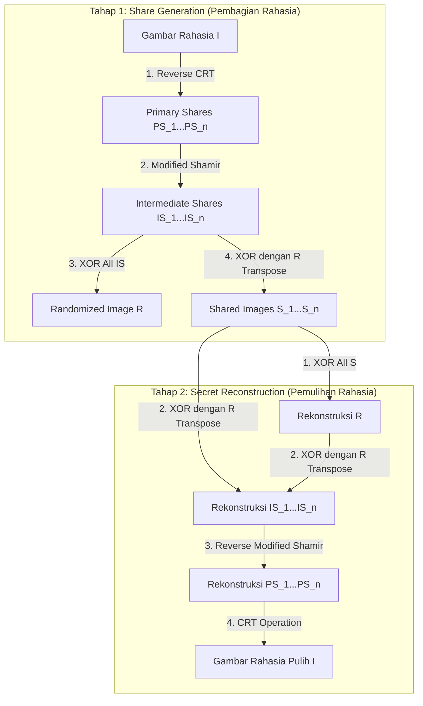

# Single Secret Sharing Scheme Berbasis Chinese Remainder Theorem (CRT), Modified Shamir, dan Operasi XOR

> **Abstrak & Ringkasan Eksekutif:**  
> Catatan pembelajaran ini membedah secara mendalam paper karya Dinesh Pande et al. (2023) mengenai *Single Secret Sharing Scheme* ($n,n$). Metode ini mengombinasikan tiga pilar utama: **Reverse Chinese Remainder Theorem (RCRT)** untuk dekomposisi rahasia awal, **Modified Shamir's Scheme** untuk pengacakan berbasis polinomial terdistribusi, serta **Operasi Bitwise XOR** dan transpose matriks acak untuk menyamarkan korelasi spasial piksel. Kombinasi ini menghasilkan skema pengamanan gambar digital dengan *perfect security*, rekonstruksi tanpa kehilangan data (*lossless reconstruction*), tanpa pembengkakan ukuran file (*zero pixel expansion*), serta efisiensi komputasi yang tinggi tanpa membutuhkan *codebook* tambahan.

---

## 1. Pendahuluan & Intuisi Dasar (Fundamental Intuition)

### 1.1 Mengapa Enkripsi Biasa Belum Cukup?
Dalam komunikasi digital standar, enkripsi kunci simetris (seperti AES) atau asimetris (seperti RSA/ECC) digunakan untuk mengamankan data. Namun, saat mengamankan data multimedia berukuran besar (seperti citra medis, dokumen rahasia, atau sinyal mentah):
1. **Titik Kegagalan Tunggal (Single Point of Failure):** Kunci enkripsi disimpan di satu tempat/pihak. Jika pihak tersebut diretas atau kuncinya bocor, seluruh rahasia langsung terbongkar.
2. **Overhead Komputasi:** Mengamankan matriks piksel besar dengan kalkulasi kunci publik sangat berat secara komputasi.

### 1.2 Konsep Analogi Secret Sharing Scheme (SSS)
Bayangkan sebuah dokumen penting di dalam brankas. Daripada memberikan satu kunci kepada satu orang, dokumen tersebut diproses menjadi $n$ bagian kertas acak (*shares*) yang dibagikan kepada $n$ pengurus tim (Alfin, Bagas, Lia, dst.). 
- Satu lembar *share* secara terpisah **tidak memberikan petunjuk apa pun** tentang isi dokumen asli (tampak seperti gambar acak / *noise*).
- Hanya ketika ke-$n$ lembar *share* digabungkan dan ditumpuk dengan kalkulasi matematika yang tepat, isi dokumen asli dapat muncul kembali 100% sempurna.

---

## 2. Landasan Matematika & Konsep Dasar (Prerequisites)

Sebelum membedah algoritma paper secara lengkap, berikut adalah empat konsep fondasi yang melandasinya.

### 2.1 Operasi Bitwise XOR ($\oplus$)
Operasi XOR (Exclusive OR) bekerja pada level biner (0 dan 1):
- $0 \oplus 0 = 0$
- $1 \oplus 1 = 0$
- $0 \oplus 1 = 1$
- $1 \oplus 0 = 1$

**Sifat Kunci Kriptografi XOR:**
1. **Self-Reversible:** Jika $A \oplus B = C$, maka $C \oplus B = A$. Artinya, XOR dengan nilai yang sama dua kali akan mengembalikan nilai asli.
2. **Randomization:** Jika nilai data $A$ di-XOR dengan angka acak sejati $R$, hasilnya $C$ akan sepenuhnya acak dan tidak berpola.

### 2.2 Matematika Modular ($a \bmod m$)
Matematika modular adalah aritmatika sisa bagi. Analogi sederhananya adalah jam dinding (sistem modulo 12). Jika sekarang jam 10 dan kita menambah 5 jam, hasilnya adalah jam 3 ($15 \bmod 12 = 3$).

Dalam kriptografi:
$$a \equiv r \pmod m$$
artinya bilangan $a$ jika dibagi $m$ memberikan sisa $r$. Contoh: $17 \bmod 5 = 2$.

### 2.3 Chinese Remainder Theorem (CRT) & Reverse CRT
**Chinese Remainder Theorem (CRT)** adalah teorema kuno matematika yang menyatakan:  
Jika kita memiliki himpunan bilangan prima relatif (coprime) $\{P_1, P_2, \dots, P_n\}$ dan sisa baginya $\{PS_1, PS_2, \dots, PS_n\}$, maka terdapat satu nilai unik $I$ (modulo $M = P_1 \times P_2 \times \dots \times P_n$) yang memenuhi seluruh persamaan sisa bagi tersebut.

- **Reverse CRT (RCRT):** Memecah angka rahasia $I$ menjadi sisa-sisa bagian ($PS_i$):
  $$PS_i \equiv I \pmod{P_i}$$
- **CRT Reconstruction:** Menggabungkan sisa-sisa bagian $PS_i$ kembali menjadi nilai asli $I$:
  $$I = \left( \sum_{i=1}^{n} PS_i \cdot m_i \cdot m_i^{-1} \right) \bmod M$$
  di mana $m_i = \frac{M}{P_i}$ dan $m_i^{-1}$ adalah invers multiplicative dari $m_i \pmod{P_i}$.

### 2.4 Shamir's Secret Sharing (Prinsip Polinomial)
Shamir’s Secret Sharing memanfaatkan sifat geometri polinomial:
- Dua titik menentukan satu garis lurus (polinomial derajat 1).
- Tiga titik menentukan satu kurva parabola (polinomial derajat 2).
- Secara umum, $k$ titik dibutuhkan untuk merekonstruksi polinomial berderajat $k-1$.

Dalam paper ini, Shamir’s Scheme dimodifikasi agar koefisien polinomialnya dibentuk dari *Primary Shares* ($PS_i$).

---

## 3. Mekanisme Internal Paper (Proposed Model)

Model yang diajukan oleh Pande et al. (2023) terdiri dari dua tahapan utama: **Proses Generasi Share** dan **Proses Rekonstruksi Rahasia**.

---

### 3.1 Algoritma Generasi Share (Share Generation Process)

Diberikan sebuah gambar rahasia $I$ dan himpunan angka coprime $P = \{P_1, P_2, \dots, P_n\}$.

#### Langkah 1: Primary Share Generation (Inverse CRT)
Setiap nilai piksel pada gambar rahasia $I$ dihitung sisa baginya terhadap masing-masing anggota himpunan coprime $P$:
$$PS_1 \equiv I \pmod{P_1}$$
$$PS_2 \equiv I \pmod{P_2}$$
$$\dots$$
$$PS_n \equiv I \pmod{P_n}$$
Hasilnya adalah $n$ matriks *Primary Shares* $\{PS_1, PS_2, \dots, PS_n\}$.

#### Langkah 2: Intermediate Share Generation (Modified Shamir's Scheme)
Primary shares diolah menggunakan polinomial terdistribusi ter-modifikasi dengan modulo 251 (bilangan prima terbesar di bawah 256):
$$IS_1 = (PS_1 + PS_2 \cdot P_1 + PS_3 \cdot P_1^2 + \dots + PS_n \cdot P_1^{n-1}) \bmod 251$$
$$IS_2 = (PS_1 + PS_2 \cdot P_2 + PS_3 \cdot P_2^2 + \dots + PS_n \cdot P_2^{n-1}) \bmod 251$$
$$\dots$$
$$IS_n = (PS_1 + PS_2 \cdot P_n + PS_3 \cdot P_n^2 + \dots + PS_n \cdot P_n^{n-1}) \bmod 251$$
Hasilnya adalah $n$ matriks *Intermediate Shares* $\{IS_1, IS_2, \dots, IS_n\}$.

#### Langkah 3: Randomized Image Generation ($R$)
Untuk menciptakan gambaran acak penyatu, seluruh *Intermediate Shares* di-XOR secara berurutan:
$$R = IS_1 \oplus IS_2 \oplus \dots \oplus IS_n$$

#### Langkah 4: Final Share Generation ($S$)
Setiap *Intermediate Share* di-XOR dengan transpose dari *Randomized Image* ($R^T$):
$$S_i = IS_i \oplus R^T \quad \text{untuk } i = 1, 2, \dots, n$$
Hasil akhirnya adalah $n$ buah matriks gambar *Shares* $\{S_1, S_2, \dots, S_n\}$ yang tampak seperti acakan *noise* statis tanpa pola.

---

### 3.2 Algoritma Rekonstruksi Rahasia (Secret Reconstruction Process)

Proses rekonstruksi bekerja dengan membalik urutan langkah generasi share.

#### Langkah 1: Rekonstruksi Randomized Image ($R$)
Seluruh gambar *Shares* $\{S_1, S_2, \dots, S_n\}$ di-XOR bersama-sama:
$$R = S_1 \oplus S_2 \oplus \dots \oplus S_n$$

#### Langkah 2: Rekonstruksi Intermediate Shares ($IS$)
Setiap *Intermediate Share* dipulihkan dengan meng-XOR kembali setiap *Share* $S_i$ dengan $R^T$:
$$IS_i = S_i \oplus R^T$$

#### Langkah 3: Rekonstruksi Primary Shares ($PS$) melalui Reverse Modified Shamir
Menggunakan metode interpolasi Lagrange pada pasangan $(IS_i, P_i)$, kita dapat menemukan kembali polinomial $F(P)$:
$$Z_i(P) = \prod_{j=1, j \neq i}^{n} \frac{P - P_j}{P_i - P_j}$$
$$F(P) = \sum_{i=1}^{n} (Z_i(P) \cdot IS_i) \cong PS_1 + PS_2 \cdot P + PS_3 \cdot P^2 + \dots + PS_n \cdot P^{n-1}$$
Koefisien dari polinomial $F(P)$ yang ditemukan adalah nilai-nilai *Primary Shares* $\{PS_1, PS_2, \dots, PS_n\}$.

#### Langkah 4: Rekonstruksi Rahasia Asli ($I$) melalui CRT
Menggunakan nilai-nilai $PS_i$ dan himpunan coprime $P_i$, rumusan Chinese Remainder Theorem diterapkan:
$$I = \left( \sum_{i=1}^{n} PS_i \cdot m_i \cdot m_i^{-1} \right) \bmod M$$
Di mana $M = \prod P_i$. Hasil akhir $I$ adalah gambar rahasia yang **100% identik** dengan gambar asli sebelum di-share.

---

## 4. Analisis Kinerja & Hasil Eksperimen Paper

Pengujian dalam paper menunjukkan performa berikut:

| Parameter Uji | Nilai Ideal | Hasil Paper | Makna |
|---|---|---|---|
| **NPCR (Number of Pixels Change Rate)** | ~99.60% - 99.99% | **99.99%** | Sangat sensitif terhadap perubahan piksel; acakan sempurna terhadap *differential attack*. |
| **UACI (Unified Average Changing Intensity)** | ~33.46% | **33.33%** | Perubahan intensitas antar piksel terdistribusi acak secara ideal. |
| **Korelasi Piksel (Correlation)** | 0 (Acak) / 1 (Identik) | **0** (Antar Share) **1** (Rekonstruksi) | Share tidak membocorkan struktur gambar; rekonstruksi 100% presisi. |
| **PSNR & RMSE** | PSNR $\to \infty$, RMSE $= 0$ | **Lossless** | Tidak ada kehilangan kualitas piksel sedikit pun pada rekonstruksi. |

---

## 5. Evaluasi Kritis: Keunggulan & Celah Kelemahan (Bahan Diskusi Dosen)

Untuk keperluan Gemastik KTI (di mana tim akan melakukan *upgrade* pada metode ini), berikut adalah poin evaluasi kritis:

### 5.1 Keunggulan Utama Paper
1. **Perfect Security:** Pembocoran sebagian share tidak mengungkapkan informasi gambar asli sedikit pun.
2. **Zero Pixel Expansion:** Ukuran setiap file share sama persis dengan ukuran gambar rahasia asli (hemat penyimpanan & bandwidth).
3. **No Codebook Overhead:** Tidak perlu menyimpan tabel kode (*codebook*) tambahan.

### 5.2 Celah Kelemahan & Peluang Upgrade (Potensi Topik KTI)
> [!IMPORTANT]
> Poin-poin ini bisa menjadi bahan diskusi utama saat bimbingan dengan dosen:

1. **Hanya untuk Single Secret (Single-Secret Limitation):**  
   Skema ini dirancang khusus untuk 1 gambar rahasia saja per proses. Di dunia nyata, sering kali dibutuhkan pengiriman banyak gambar (*multi-secret sharing*) secara efisien dalam satu gelombang share.
2. **Skema $(n,n)$ Threshold Tanpa Toleransi Kerusakan:**  
   Metode ini mewajibkan **seluruh $n$ share** hadir lengkap. Jika ada 1 share yang hilang atau rusak total di tengah jalan, rahasia **gagal total** direkonstruksi. Belum mendukung skema $(t, n)$ threshold fleksibel secara murni di mana cukup $t$ dari $n$ share ($t < n$) untuk memulihkan rahasia.
3. **Keterbatasan Modulo 251:**  
   Penggunaan modulo 251 (karena 251 adalah bilangan prima terdekat di bawah range piksel 8-bit [0-255]) berpotensi menimbulkan *clipping* atau perlakuan khusus pada nilai piksel antara 251-255.

---

## 6. Peta Referensi & Konsep Terkait

- **Sumber Utama Vault:** [[s11277-023-10315-5|Paper Dinesh Pande et al. (2023)]]
- **Konsep Terkait di Brain Atlas:**
  - [[Secret_Sharing_Scheme]]
  - [[Chinese_Remainder_Theorem]]
  - [[Shamir_Secret_Sharing]]
