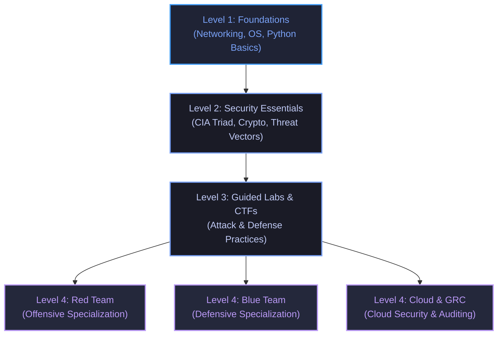

## The reading

### 1. Introduction: The Self-Paced Dependency Philosophy
Cybersecurity is vast, and attempting to study it along a rigid timeline often leads to burnout or surface-level understanding. To learn naturally and flow with your curiosity, this roadmap is organized as a **Dependency-Based Skill Tree**. 

Unlock new skill categories ("nodes") as you master their fundamentals, and feel free to dive deep or pivot between offensive and defensive tracks as you explore.

---

### 2. Level 1: Foundations (Prerequisite for Everything)
You cannot secure or attack what you do not understand. Start here to build the baseline system engineering skills needed to run labs and understand network data.

#### 1. Computer Networking
*   **Protocols:** Learn how data travels across the internet. Master the OSI and TCP/IP models. Study IP, TCP, UDP, DNS, DHCP, HTTP/HTTPS, SSH, and ICMP.
*   **Subnetting & Routing:** Understand IP assignment, routers, and gateway concepts.
*   **Packet Captures:** Use **Wireshark** to inspect network traffic. Understand what normal HTTP requests and TCP connections look like.

#### 2. Operating Systems
*   **Linux Administration:** Navigate the terminal, manage directories, configure permissions (`chmod`, `chown`), and write basic Bash scripts.
*   **Windows Internals:** Learn about active directories, local system registry settings, PowerShell scripting, and event log management.

#### 3. Scripting Basics
*   **Python:** Learn variables, loops, functions, lists, and directories.
    *   *Why:* To automate scans, parse large log files, and build simple exploitation/defense tools.

#### Key Resources
*   *Pre-Security Path* (TryHackMe)
*   *Linux 100: Fundamentals* (TCM Security Academy - Free)
*   *Computer Networking Course* (YouTube - NetworkChuck)

---

### 3. Level 2: Security Essentials & Threat Landscape
*Prerequisites: Level 1 Foundations*

With an understanding of IT infrastructure, learn the basic security concepts and threat models that dictate defense strategies.

#### 1. Security Paradigms
*   **The CIA Triad:** Confidentiality (restricting access), Integrity (maintaining accuracy), and Availability (ensuring access when needed).
*   **Access Control:** Understand Identity & Access Management (IAM), Authentication vs. Authorization, and the Principle of Least Privilege.

#### 2. Applied Cryptography
*   **Encryption:** Symmetric (AES - fast, single key) vs. Asymmetric (RSA/ECC - public/private key pairs for secure exchanges).
*   **Hashing:** One-way functions (SHA-256) used to verify data integrity and secure password storage.

#### 3. Attack Categories
*   **Web Exploitation:** Study the OWASP Top 10 vulnerabilities, specifically SQL Injection (SQLi) and Cross-Site Scripting (XSS).
*   **Social Engineering & Malware:** Understand phishing vectors, ransomware execution, worms, and trojans.

#### Key Resources
*   *Introduction to Cybersecurity Path* (TryHackMe)
*   *Practical Security Fundamentals* (TCM Security Academy - Free)

---

### 4. Level 3: Guided Labs & Capture the Flag (CTFs)
*Prerequisites: Level 2 Security Essentials*

Now you are ready to apply your knowledge in secure, sandboxed labs. Focus on learning how to use security software tools.

#### 1. Building a Home Lab
*   **Virtualization:** Run VirtualBox or VMware Workstation.
*   **Targets:** Configure a host-only virtual network. Spin up **Kali Linux** (offensive OS) alongside vulnerable target VMs (e.g., Metasploitable, OWASP Juice Shop).

#### 2. Hands-on Security Labs
*   **PortSwigger Web Security Academy:** Practice attacking SQLi, CSRF, and directory traversal vulnerabilities in free interactive labs.
*   **Gamified Capture the Flags (CTFs):** Work through TryHackMe rooms to practice guided hacking, and Hack The Box to practice independent, less-guided target exploitation.
*   **Log Inspection:** Practice querying Windows Event Logs and Sysmon data to detect anomalies and unauthorized tool executions.

#### Recommended Milestone Projects
*   **Write a Port Scanner:** Use Python to write a multi-threaded network scanner that probes ports and checks for active services.
*   **Lab Write-Up Portfolio:** Write three clear guides detailing how you solved particular CTF boxes, describing the exploit mechanisms and recommended patches.

---

### 5. Level 4: Specializations (Choose Your Branch)
*Prerequisites: Level 3 Labs & CTFs*

At this level, select the track that matches your goals. You can shift paths dynamically as you learn.

#### Branch A: Red Team (Offensive Security)
*   **Focus:** Pen testing, exploit research, network infiltration.
*   **Target Skills:** Active Directory exploitation, privilege escalation, and evasion.
*   *Milestone Project:* Capture a user and root flag on an intermediate Hack The Box machine, producing a professional pentesting report.
*   *Resources & Certifications:* eJPT (eLearnSecurity Junior Penetration Tester) or OSCP (Offensive Security Certified Professional).

#### Branch B: Blue Team (Defensive Security)
*   **Focus:** Incident detection, SOC operations, malware analysis, digital forensics.
*   **Target Skills:** Mastering SIEM systems (Splunk, ELK), logging analysis, and endpoint detection.
*   *Milestone Project:* Set up a local SIEM system (like ELK or Wazuh) in your home lab, ingest logs from a Windows system, and generate an alert when a brute-force attack is simulated.
*   *Resources & Certifications:* BTL1 (Blue Team Level 1) or CompTIA CySA+.

#### Branch C: Cloud Security & GRC (Governance, Risk & Compliance)
*   **Focus:** Auditing, risk management, and cloud platform compliance.
*   **Target Skills:** AWS/Azure IAM configuration, writing policy documentation, and understanding compliance guidelines (ISO 27001, SOC2).
*   *Milestone Project:* Build a secure AWS infrastructure template with strictly configured IAM users, secure S3 buckets, and CloudTrail auditing activated.
*   *Resources & Certifications:* CCSP (Certified Cloud Security Professional) or AWS Certified Security Specialty.

---

## Concepts to extract
- [ ] [[Cybersecurity_Roadmap]]
- [x] [[CIA Triad]]
- [ ] [[Symmetric vs. Asymmetric Encryption]]
- [x] [[Blue Team vs. Red Team]]
