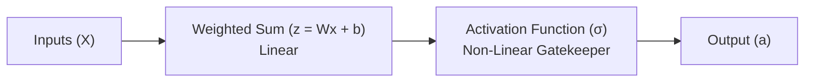

## The reading

In artificial neural networks, an **activation function** is a mathematical formula applied to the output of a neuron. It determines whether a neuron should "fire" (be activated) and how strong its signal should be, based on the input it receives.

Without activation functions, neural networks would be limited to solving simple linear problems (like drawing straight lines). Activation functions introduce **non-linearity**, enabling networks to learn complex patterns in images, audio, and text.

---

### 1. The Core Mechanism: From Linear to Non-Linear
A neural network neuron performs two steps:
1.  **Linear Summation:** Combines input values ($X$) with weights ($W$) and adds a bias ($b$):
    $$z = \sum (w_i \cdot x_i) + b$$
2.  **Activation:** Passes $z$ through an activation function ($\sigma$) to produce the final output ($a$):
    $$a = \sigma(z)$$

#### Why Non-Linearity is Essential
If we do not use an activation function, the neuron output is purely linear ($a = z$). If we stack multiple layers of linear neurons, the overall model remains completely linear. For example, a two-layer linear network computes:
$$a_2 = W_2(W_1 X + b_1) + b_2 = (W_2 W_1) X + (W_2 b_1 + b_2) = W_{\text{combined}} X + b_{\text{combined}}$$

Mathematically, this means a 100-layer neural network without activation functions has the exact same learning capacity as a single-layer model. Non-linear activation functions allow the network to warp, bend, and shape the data space to draw complex decision boundaries.

---

### 2. Common Activation Functions

#### 1. Sigmoid Function
The Sigmoid function maps any real-valued number into a value between $0$ and $1$.
*   **Formula:** 
    $$\sigma(z) = \frac{1}{1 + e^{-z}}$$
*   **Range:** $(0, 1)$
*   **Primary Use Case:** Output layer of binary classification models.

#### 2. Tanh Function
*   **Formula:** $\tanh(z) = \frac{e^z - e^{-z}}{e^z + e^{-z}}$
*   **Range:** $(-1, 1)$

#### 3. ReLU Function
*   **Formula:** $f(z) = \max(0, z)$
*   **Range:** $[0, \infty)$

#### 4. Leaky ReLU
*   **Formula:** $f(z) = \max(\alpha z, z)$

#### 5. Softmax Function
*   **Formula:** $\text{Softmax}(z_i) = \frac{e^{z_i}}{\sum_{j} e^{z_j}}$

---

## Related Generated Readings
- [[Comprehensive Guide to Activation Functions and Gradient Flow]]
